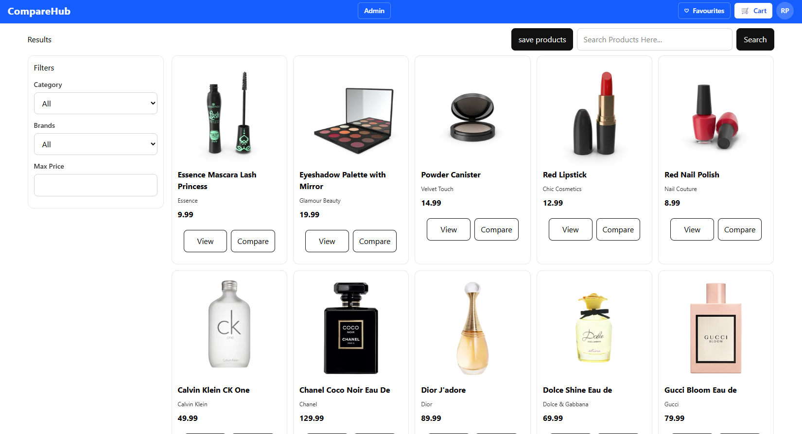
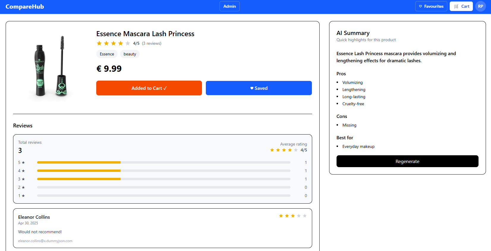
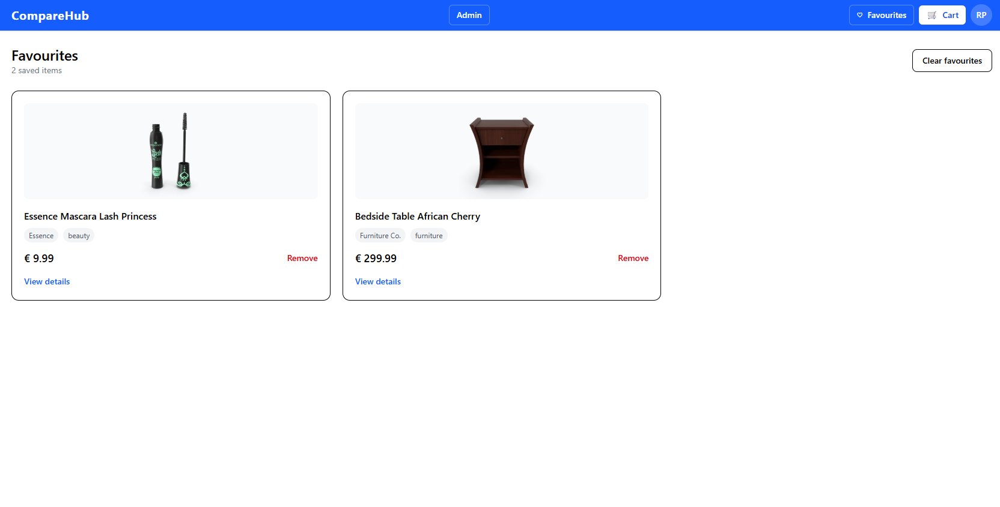
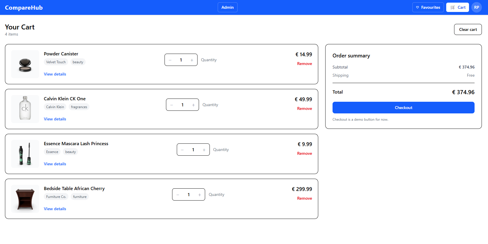
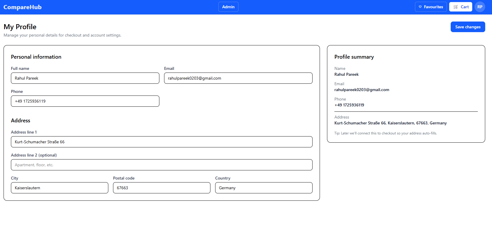
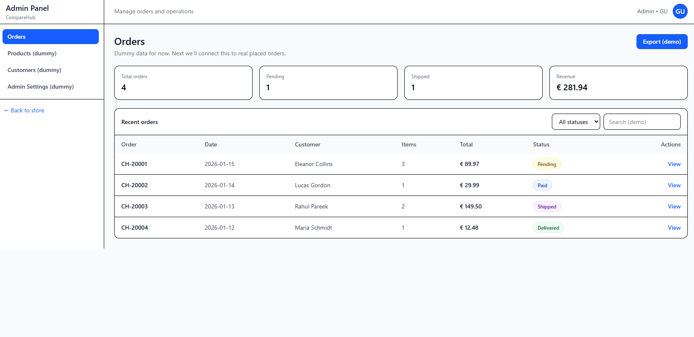

# CompareHub 🛒  
**A design-driven, AI-enhanced product comparison & shopping web application**

CompareHub is a modern web application that demonstrates how **design intent can be translated into precise, structured, and maintainable frontend solutions**, while also integrating **AI/LLM capabilities** to enhance user understanding and decision-making.

The project focuses on **clarity, usability, and real-world e-commerce workflows**, combining strong UI/UX principles with modern frontend engineering and applied AI features.

---

## ✨ Key Features

### 🏠 Product Discovery & Browsing
- Clean, responsive product listing with card-based layout  
- Category and brand-based filtering  
- Clear calls to action (View, Compare, Save)  
- Design prioritises visual hierarchy, spacing, and readability  

📸 **Product Listing**


---

### 🔍 Product Details with AI Summary
- Detailed product view with pricing, ratings, and reviews  
- Add to cart & save to favourites  
- **AI-powered product summary panel** using LLMs:
  - Auto-generated highlights
  - Pros & cons
  - Best-use recommendations  
- Designed to support faster, more confident purchase decisions  

📸 **Product Details + AI Summary**


---

### 🤖 AI Capabilities (LLM Integration)

The application integrates **LLM-based AI features** to enhance user experience:

- **AI Product Summary Generation**  
  Automatically generates concise, structured summaries from product metadata and reviews.

- **AI Chat Interface (Planned / Demo-ready)**  
  Designed to support conversational product queries and assistance.

- **Document / Content Categorisation**  
  AI-driven categorisation logic prepared for organising products, reviews, and content efficiently.

> These features showcase practical AI integration within a frontend-focused web application, emphasising usability and real-world value rather than experimentation.

---

### ❤️ Favourites
- Save and manage favourite products  
- Persistent favourites view  
- Quick access to shortlisted items  

📸 **Favourites**


---

### 🛒 Shopping Cart & Order Summary
- Add, remove, and update item quantities  
- Real-time price calculations  
- Clear order summary (subtotal, shipping, total)  
- UX optimised to reduce friction during checkout  

📸 **Cart**


---

### 👤 User Profile
- Editable personal information (name, email, phone, address)  
- Clean, structured form layout  
- Prepared for future checkout and account integration  

📸 **User Profile**


---

### 🛠️ Admin Panel (Demo)
- Admin dashboard for operational overview  
- Order management with status tracking  
- Revenue and order statistics  
- Table-based UI focused on clarity and maintainability  

📸 **Admin Panel**


---

## 🎨 Design & UX Philosophy

This project was built with a strong focus on:
- Translating **design concepts into clean technical implementation**
- Consistent spacing, typography, and layout structure  
- User-centric flows inspired by real-world e-commerce platforms  
- Maintainable component structure and predictable UI behaviour  

My background in **content creation** influenced the emphasis on clarity, storytelling, and customer-oriented layouts across the application.

---

## 🧩 Tech Stack

- **Frontend:** React, TypeScript, Vite  
- **Styling:** Modern CSS with design-first approach  
- **State & Logic:** Component-driven architecture  
- **AI / LLM:** Summary generation, chat-ready interfaces, content categorisation  
- **Data:** Dummy/static data (frontend-focused demo)

---

## 🚀 Local Setup

```bash
npm install
npm run dev
